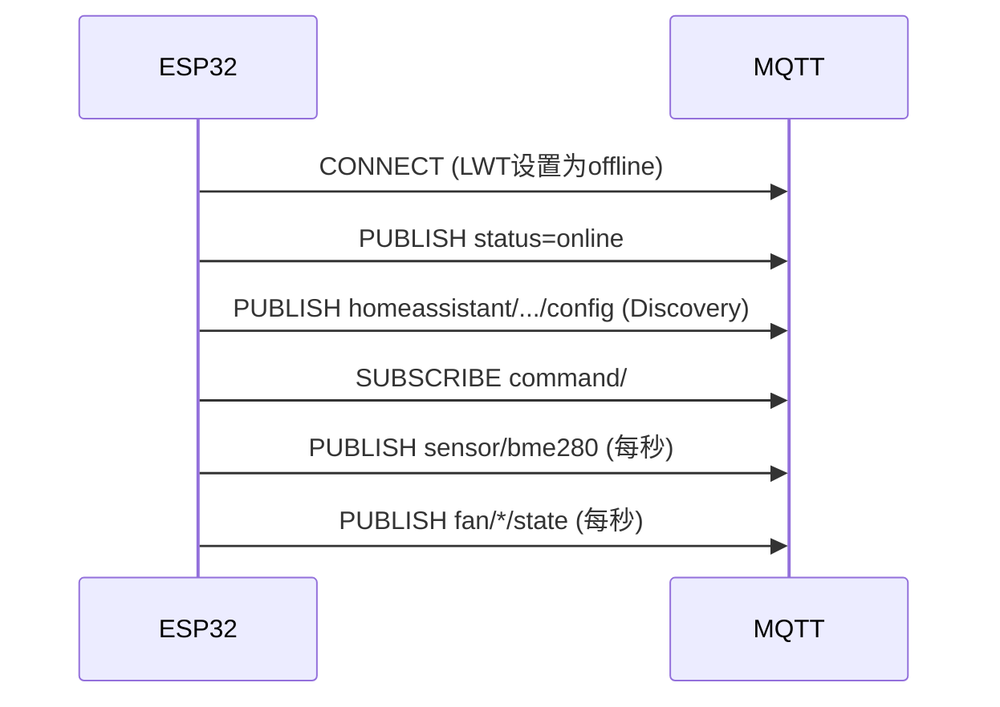
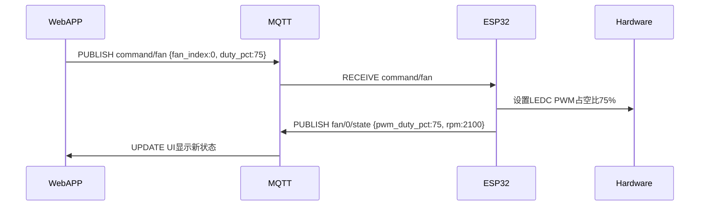
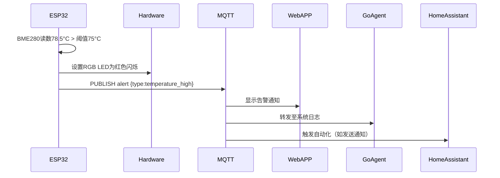

# MQTT协议规范 - 服务器智能风扇控制系统

**版本**: v1.0  
**最后更新**: 2026-07-30

---

## 概述

本系统使用MQTT 3.1.1协议作为统一通信层，连接ESP32-S3固件、Go Linux Agent、Web后端和Home Assistant。所有设备通过MQTT Broker（推荐Mosquitto/EMQX）进行消息交换。

**核心原则**:
- 所有JSON消息必须包含 `timestamp`（Unix秒）和 `device_id`（设备唯一标识）
- QoS 0用于高频遥测数据（传感器读数），QoS 1用于控制指令和告警
- Last Will Testament (LWT) 用于设备在线状态管理
- Home Assistant MQTT Discovery兼容

---

## Topic命名空间

统一前缀: `fan-controller/{device_id}/`

| Topic类别 | Topic模板 | QoS | 方向 | 说明 |
|----------|-----------|:---:|:----:|------|
| **Status** | `fan-controller/{device_id}/status` | 1 | 设备→Broker | 设备在线状态（LWT遗嘱消息）|
| **Sensor** | `fan-controller/{device_id}/sensor/{type}` | 0 | 设备→Broker | 传感器数据上报 |
| **Fan** | `fan-controller/{device_id}/fan/{index}/state` | 0 | 设备→Broker | 风扇状态上报 |
| **Command** | `fan-controller/{device_id}/command/{action}` | 1 | Broker→设备 | 控制指令下发 |
| **Alert** | `fan-controller/{device_id}/alert` | 1 | 设备→Broker | 告警消息 |
| **Config** | `fan-controller/{device_id}/config/{section}` | 1 | 双向 | 配置更新 |
| **OTA** | `fan-controller/{device_id}/ota` | 1 | Broker→设备 | 固件更新触发 |
| **Discovery** | `homeassistant/{component}/{device_id}/{object_id}/config` | 1 | 设备→Broker | Home Assistant自动发现 |

**{device_id}**: 设备唯一标识，格式 `esp32-XXXXXX`（ESP32-S3 MAC地址后6位）  
**{type}**: 传感器类型 `bme280`, `ds18b20`, `voltage`, `internal_temp`  
**{index}**: 风扇索引 `0`, `1`, `2`, `3`  
**{action}**: 控制动作 `fan`, `curve`, `reboot`, `reset`  
**{section}**: 配置段 `wifi`, `mqtt`, `alert`, `curve`

---

## 1. Status — 设备状态（LWT）

### 1.1 设备上线

**Topic**: `fan-controller/{device_id}/status`  
**Payload**:
```json
{
  "timestamp": 1722315503,
  "device_id": "esp32-a1b2c3",
  "status": "online",
  "firmware_version": "v1.0.0",
  "ip_address": "192.168.1.100",
  "uptime_seconds": 3600
}
```

### 1.2 设备离线（LWT遗嘱）

**Payload**:
```json
{
  "timestamp": 1722315503,
  "device_id": "esp32-a1b2c3",
  "status": "offline"
}
```

**MQTT连接参数**:
- LWT Topic: `fan-controller/{device_id}/status`
- LWT Payload: 离线JSON
- LWT QoS: 1
- LWT Retain: true

---

## 2. Sensor — 传感器数据

### 2.1 BME280环境传感器

**Topic**: `fan-controller/{device_id}/sensor/bme280`  
**频率**: 1秒  
**Payload**:
```json
{
  "timestamp": 1722315503,
  "device_id": "esp32-a1b2c3",
  "temperature_c": 25.3,
  "humidity_pct": 45.2,
  "pressure_hpa": 1013.25
}
```

### 2.2 DS18B20远程温度探头

**Topic**: `fan-controller/{device_id}/sensor/ds18b20`  
**频率**: 1秒  
**Payload**:
```json
{
  "timestamp": 1722315503,
  "device_id": "esp32-a1b2c3",
  "sensors": [
    {"address": "28-00000a1b2c3d", "temperature_c": 35.5, "valid": true},
    {"address": "28-00000e4f5g6h", "temperature_c": 42.1, "valid": true}
  ]
}
```

### 2.3 电源电压监控

**Topic**: `fan-controller/{device_id}/sensor/voltage`  
**频率**: 5秒  
**Payload**:
```json
{
  "timestamp": 1722315503,
  "device_id": "esp32-a1b2c3",
  "voltage_12v": 12.05,
  "voltage_5v": 5.02,
  "voltage_3v3": 3.31
}
```

### 2.4 ESP32内部温度

**Topic**: `fan-controller/{device_id}/sensor/internal_temp`  
**频率**: 5秒  
**Payload**:
```json
{
  "timestamp": 1722315503,
  "device_id": "esp32-a1b2c3",
  "temperature_c": 45.2
}
```

---

## 3. Fan — 风扇状态

### 3.1 风扇状态上报

**Topic**: `fan-controller/{device_id}/fan/{index}/state`  
**频率**: 1秒（每路风扇独立发布）  
**Payload**:
```json
{
  "timestamp": 1722315503,
  "device_id": "esp32-a1b2c3",
  "fan_index": 0,
  "pwm_duty_pct": 65,
  "rpm": 1850,
  "stalled": false,
  "mode": "auto"
}
```

**字段说明**:
- `pwm_duty_pct`: PWM占空比百分比 (0-100)
- `rpm`: 转速（转/分钟）
- `stalled`: 停转检测（true=风扇停转）
- `mode`: 控制模式 `"auto"`（自动曲线）或 `"manual"`（手动）

---

## 4. Command — 控制指令

### 4.1 风扇转速控制

**Topic**: `fan-controller/{device_id}/command/fan`  
**Payload**:
```json
{
  "timestamp": 1722315503,
  "device_id": "esp32-a1b2c3",
  "fan_index": 0,
  "mode": "manual",
  "duty_pct": 75
}
```

**响应**: 设备通过 `fan/{index}/state` 上报新状态

### 4.2 风扇曲线配置

**Topic**: `fan-controller/{device_id}/command/curve`  
**Payload（固定查表LUT模式）**:
```json
{
  "timestamp": 1722315503,
  "device_id": "esp32-a1b2c3",
  "fan_index": 0,
  "mode": "lut",
  "temperature_source": "bme280",
  "points": [
    {"temp_c": 30, "duty_pct": 20},
    {"temp_c": 40, "duty_pct": 40},
    {"temp_c": 50, "duty_pct": 60},
    {"temp_c": 60, "duty_pct": 80},
    {"temp_c": 70, "duty_pct": 100}
  ]
}
```

**Payload（PID自适应模式）**:
```json
{
  "timestamp": 1722315503,
  "device_id": "esp32-a1b2c3",
  "fan_index": 0,
  "mode": "pid",
  "temperature_source": "ds18b20_0",
  "setpoint_c": 50.0,
  "kp": 2.0,
  "ki": 0.1,
  "kd": 0.5
}
```

### 4.3 设备重启

**Topic**: `fan-controller/{device_id}/command/reboot`  
**Payload**:
```json
{
  "timestamp": 1722315503,
  "device_id": "esp32-a1b2c3"
}
```

### 4.4 恢复出厂设置

**Topic**: `fan-controller/{device_id}/command/reset`  
**Payload**:
```json
{
  "timestamp": 1722315503,
  "device_id": "esp32-a1b2c3",
  "confirm": true
}
```

---

## 5. Alert — 告警消息

**Topic**: `fan-controller/{device_id}/alert`  
**Payload**:
```json
{
  "timestamp": 1722315503,
  "device_id": "esp32-a1b2c3",
  "alert_type": "temperature_high",
  "severity": "critical",
  "message": "温度超过阈值: BME280 = 78.5°C (阈值75°C)",
  "value": 78.5,
  "threshold": 75.0,
  "sensor": "bme280"
}
```

**告警类型** (`alert_type`):
- `temperature_high`: 温度过高
- `fan_stalled`: 风扇停转
- `voltage_abnormal`: 电压异常
- `wifi_disconnected`: WiFi断开超过60秒

**严重性** (`severity`):
- `warning`: 警告（黄色LED）
- `critical`: 严重（红色LED）

---

## 6. Config — 配置管理

### 6.1 WiFi配置

**Topic**: `fan-controller/{device_id}/config/wifi`  
**Payload**:
```json
{
  "timestamp": 1722315503,
  "device_id": "esp32-a1b2c3",
  "ssid": "MyNetwork",
  "password": "********"
}
```

### 6.2 告警规则配置

**Topic**: `fan-controller/{device_id}/config/alert`  
**Payload**:
```json
{
  "timestamp": 1722315503,
  "device_id": "esp32-a1b2c3",
  "rules": [
    {"type": "temperature_high", "threshold": 75.0, "enabled": true},
    {"type": "fan_stalled", "threshold": 200, "enabled": true},
    {"type": "voltage_abnormal", "12v_min": 10.8, "12v_max": 13.2, "enabled": true}
  ]
}
```

---

## 7. OTA — 固件更新

**Topic**: `fan-controller/{device_id}/ota`  
**Payload**:
```json
{
  "timestamp": 1722315503,
  "device_id": "esp32-a1b2c3",
  "firmware_url": "https://example.com/firmware/v1.1.0.bin",
  "version": "v1.1.0",
  "checksum_sha256": "a1b2c3..."
}
```

**OTA状态反馈**:

**Topic**: `fan-controller/{device_id}/ota/status`  
**Payload**:
```json
{
  "timestamp": 1722315503,
  "device_id": "esp32-a1b2c3",
  "state": "downloading",
  "progress_pct": 45,
  "message": "Downloading firmware..."
}
```

**状态值** (`state`):
- `downloading`: 下载中
- `verifying`: 校验中
- `flashing`: 烧录中
- `success`: 成功（即将重启）
- `failed`: 失败

---

## 8. Home Assistant MQTT Discovery

### 8.1 设备实体配置

**Topic**: `homeassistant/sensor/{device_id}/temperature/config`  
**Payload**:
```json
{
  "name": "Fan Controller Temperature",
  "device_class": "temperature",
  "state_topic": "fan-controller/esp32-a1b2c3/sensor/bme280",
  "value_template": "{{ value_json.temperature_c }}",
  "unit_of_measurement": "°C",
  "unique_id": "esp32_a1b2c3_temp",
  "device": {
    "identifiers": ["esp32-a1b2c3"],
    "name": "Smart Fan Controller",
    "model": "ESP32-S3-N16R8",
    "manufacturer": "DIY",
    "sw_version": "v1.0.0"
  }
}
```

### 8.2 风扇实体（可控）

**Topic**: `homeassistant/fan/{device_id}/fan0/config`  
**Payload**:
```json
{
  "name": "Fan 0",
  "command_topic": "fan-controller/esp32-a1b2c3/command/fan",
  "state_topic": "fan-controller/esp32-a1b2c3/fan/0/state",
  "percentage_command_topic": "fan-controller/esp32-a1b2c3/command/fan",
  "percentage_state_topic": "fan-controller/esp32-a1b2c3/fan/0/state",
  "percentage_value_template": "{{ value_json.pwm_duty_pct }}",
  "payload_on": "{\"fan_index\":0,\"mode\":\"manual\",\"duty_pct\":100}",
  "payload_off": "{\"fan_index\":0,\"mode\":\"manual\",\"duty_pct\":0}",
  "unique_id": "esp32_a1b2c3_fan0",
  "device": {
    "identifiers": ["esp32-a1b2c3"]
  }
}
```

---

## 9. 消息流示例

### 9.1 启动流程



### 9.2 风扇手动控制



### 9.3 温度告警



---

## 10. 离线消息队列

当设备断网时，固件将最多缓存 **50条** 消息到Flash存储（`storage`分区）：
- 传感器数据: 每30秒采样1次（降频）
- 告警消息: 全部保留
- 风扇状态: 每30秒采样1次

重连后批量发送，Topic后缀添加 `/buffered`：
```
fan-controller/{device_id}/sensor/bme280/buffered
```

Payload增加 `buffered: true` 标记：
```json
{
  "timestamp": 1722315503,
  "device_id": "esp32-a1b2c3",
  "buffered": true,
  "temperature_c": 25.3,
  "humidity_pct": 45.2,
  "pressure_hpa": 1013.25
}
```

---

## 11. 实现注意事项

### ESP32固件侧
- 使用 `esp_mqtt_client_config_t.lwt_topic/lwt_msg` 配置LWT
- 所有JSON消息用 `cJSON` 库构造（不用 `sprintf`）
- 订阅通配符 `fan-controller/{device_id}/command/#`
- `device_id` 从ESP32 MAC地址生成：`esp32-` + MAC后6位hex

### Go Agent侧
- 订阅 `fan-controller/+/sensor/#` 监听所有设备传感器数据
- 订阅 `fan-controller/+/alert` 接收告警转发至系统日志
- 发布GPU/CPU数据到自定义Topic `system-monitor/{hostname}/sensor/gpu`

### Web后端侧
- WebSocket每2秒向前端推送最新缓存的设备状态
- 订阅所有设备的 `status` Topic维护在线设备列表
- 控制指令从REST API转换为MQTT PUBLISH

### Home Assistant侧
- 固件启动后自动发布所有Discovery配置（重启HA后自动识别）
- 实体 `unique_id` 必须全局唯一
- `state_topic` 和 `command_topic` 必须匹配协议规范

---

## 12. 协议版本演进

**v1.0** (当前):
- 基础传感器/风扇/告警/OTA功能
- Home Assistant Discovery支持

**未来计划**:
- v1.1: 增加风扇曲线配置历史记录
- v1.2: 支持多个MQTT Broker备份
- v2.0: 支持MQTT 5.0协议（增强认证和元数据）

---

**文档结束**
