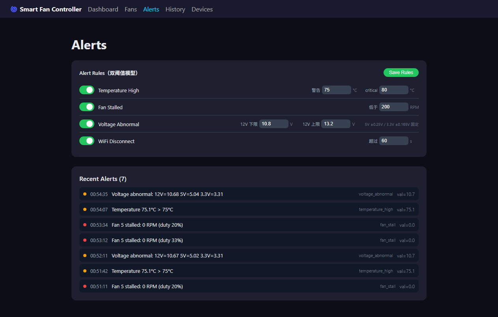

# 协议模拟器（Track B）验证报告

| 项 | 值 |
|---|---|
| 验证日期 | 2026-10-02（Asia/Shanghai） |
| 交付提交 | `c417175 feat(test): add protocol simulator`（6 files, +1985） |
| 契约真源 | `docs/protocol.md` v1.0.1 + `firmware/main/main.c` 及各 component 行为 |
| 契约自检 | **PASS: 43　FAIL: 0**（`node selftest.js --broker mqtt://192.168.3.131:1883`） |
| 冒烟回归 | **PASS: 25　FAIL: 0**（仓库根目录 `./test/smoke_test.sh 192.168.3.131 localhost`，exit 0） |
| 联调环境 | Broker = 轨道 A 部署的 `192.168.3.131:1883`；本机 web backend/frontend + 模拟器 |

> 证据归档于本目录 `simulator-evidence/`（自检日志、冒烟日志、4 张 Web 控制台截图）。
> 原始文件生成于 `.omo/evidence/`（AI 过程产物，不入库）。

---

## 1. 交付物

| 文件 | 说明 |
|---|---|
| `test/simulator/simulator.js` | 设备模拟器（Node.js + `mqtt`，设备默认 `esp32-sim0001`） |
| `test/simulator/selftest.js` | 43 项协议契约自检（可复现证据） |
| `test/simulator/README.md` | 用法、环境变量、topic/命令契约、与固件差异、联调步骤 |
| `test/simulator/package.json` + lock | 仅依赖 `mqtt@^5.8.1` |
| `.gitignore` | 增加 `test/simulator/node_modules/` |

## 2. 契约实现

status(online，QoS1+retain，含 `uptime_seconds`) / bme280 / ds18b20(双探头 address/valid) /
voltage / internal_temp / 8 路 `fan/{0-7}/state`(1s) / `alert` 事件 + `alert/{type}/state`(retained)；
`timestamp` 全为 Unix 秒(FW-15)；LWT 发 retained offline。

订阅 `command/#` 与 `config/#`：

- `fan`（恒 MANUAL + duty→rpm 一阶随动）
- `curve`（切 AUTO，LUT 线性插值 / PID 平铺字段 / `temperature_source` 4 值枚举 / temp_c 严格递增校验）
- `reboot`（发 offline → 断开 → 重连 online 作回执）
- `reset`（confirm 门控）
- `ota`（downloading→verifying→success→重启换版本）
- `config/alert` get/set
- 越界命令丢弃且设备存活（FW-20⑤）

数值缓慢随机漂移，可注入温升 / 12V 跌落 / 停转场景产生告警。

## 3. 联调证据

**契约自检**：`node selftest.js --broker mqtt://192.168.3.131:1883` → **PASS: 43 FAIL: 0**
（含 QoS/retain、越界防御、SIGKILL 后 broker 自动发 retained offline）。
日志：[simulator-selftest.log](simulator-evidence/simulator-selftest.log)

**Web 全链路**（后端 `MQTT_BROKER=mqtt://192.168.3.131:1883` + vite）：

- WS 推送出现 `esp32-sim0001`
- Fans 页 `POST /fan/3 {speed:60}` → 回执 `duty=60% mode=manual`、rpm 1383→1888 随动
- `/fan/3/curve` → 回 `mode=auto` duty=20%（LUT 期望值一致）
- History BME280 漂移 4 个不同值
- Alerts 缓存 7 条事件（temperature_high warning/critical、fan_stall、voltage_abnormal）

| Dashboard | Alerts |
|---|---|
|  |  |

另见 [History](simulator-evidence/simulator-web-history.png)、[Fans](simulator-evidence/simulator-web-fans.png)。

**冒烟回归**：`./test/smoke_test.sh 192.168.3.131 localhost` → **PASS: 25 FAIL: 0**（exit 0）。
日志：[simulator-smoke-final.log](simulator-evidence/simulator-smoke-final.log)

## 4. 并发提交事故与修复（与主会话共同确认）

模拟器会话写入中途，主会话（Track A 结果处理）在同一工作区提交时，把本会话已 `git add`
的 `test/simulator/**` 连同 1318 个 `node_modules` 文件扫进了其 docs 提交（`2bfd626`）。
因当时均未推送，本会话做了内容零丢失的本地历史重建：

- 主会话 docs 改动原样保留，重建为 `aaea981`（同 message、同内容，不含模拟器与 node_modules）
- 本会话交付独立成 `c417175`，仅 6 个文件
- `6593185`、`d0eedd6` 未改动；全历史 `node_modules` 0 条

**教训**：同一仓库不要开两个会话并行做 git 写操作；并行任务应各自使用 `git worktree`。

## 5. 环境说明

- 本机无 docker/mosquitto；为跑冒烟脚本下载了官方 Mosquitto 2.1.2 Windows 构建解压至
  `C:\Users\OneAs\.tools\mosquitto`（仓库外，仅供 `mosquitto_pub/sub`）。
- 自检过程中修复模拟器自身 3 个缺陷：风扇 `mode/curve` 字段错配导致 duty 恒 0、
  告警演示开关与重复周期耦合导致场景 2 不注入、高温时湿度被压到 5%（已改为合理模型）。

---

**版本**：2026-10-02 · 执行会话：轨道 B（ZCode）
**配套交付物**：`test/simulator/`（见上）
